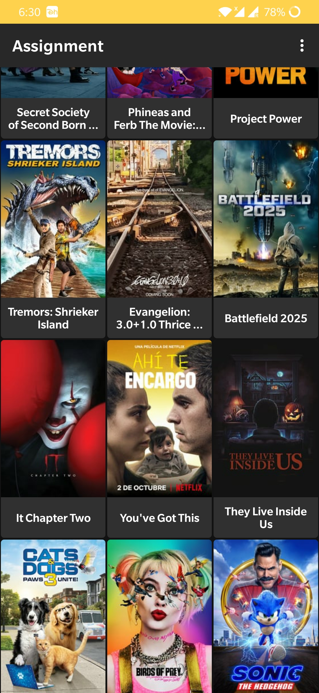
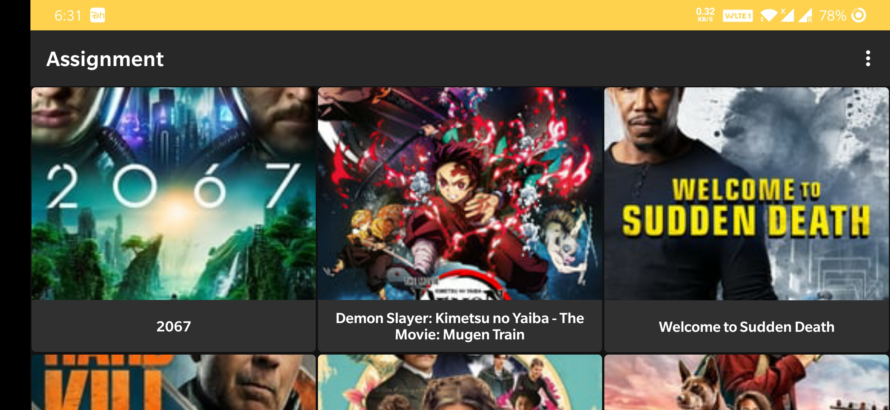
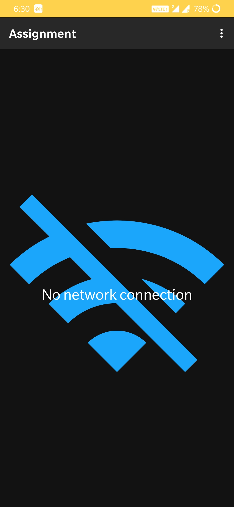

# Assignment2
# Mvvm Assignment.

|||

# Libraries used
* AndroidX - Previously known as 'Android support Library'
* Glide - for loading and caching images
* Retrofit 2 - Type-safe HTTP client for Android and Java by Square, Inc.
* Gson - for serialization/deserialization Java Objects into JSON and back
* LiveData
* ViewModel
* Paging
* DataBinding
* OkHttp
* Timber
* CircleImageView
* TextDrawable

# External Resources 
* <a href="https://stackoverflow.com/questions/37741872/how-to-make-custom-dotted-progress-bar-in-android">stackoverflow</a> - for custom dotted progress bar
* <a href="https://github.com/android/architecture-components-samples">github/android</a> - Proper use of Architecture Components
* <a href="https://codingwithmitch.com/courses/">github/CodingWithMitch</a>courses
